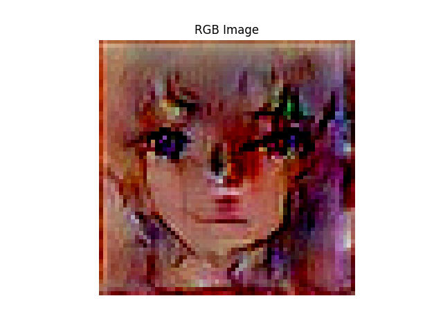
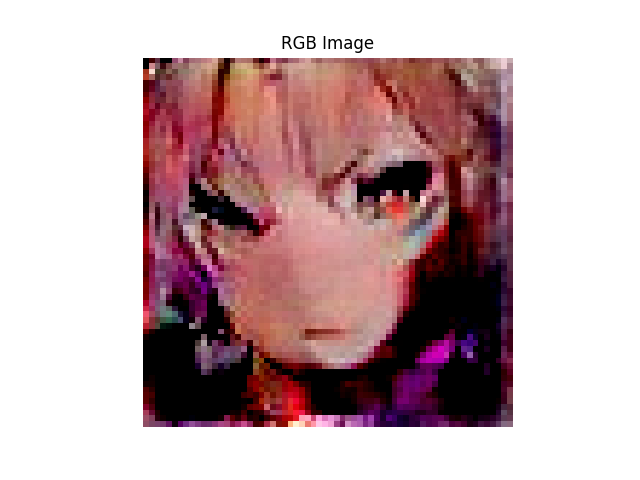
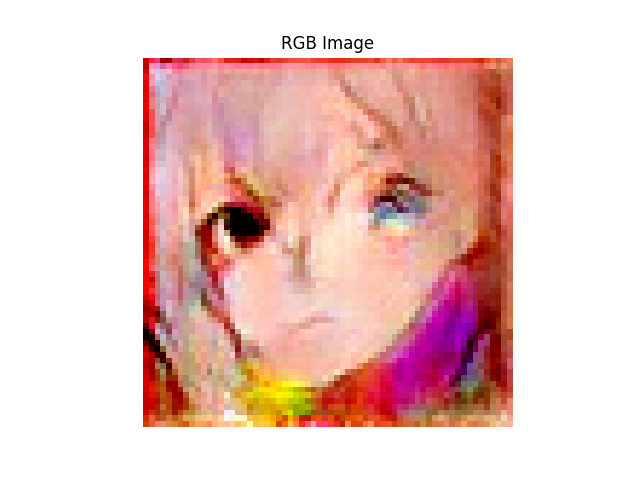
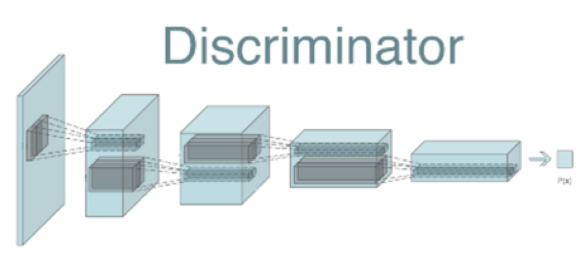
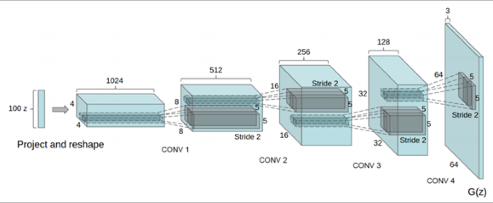
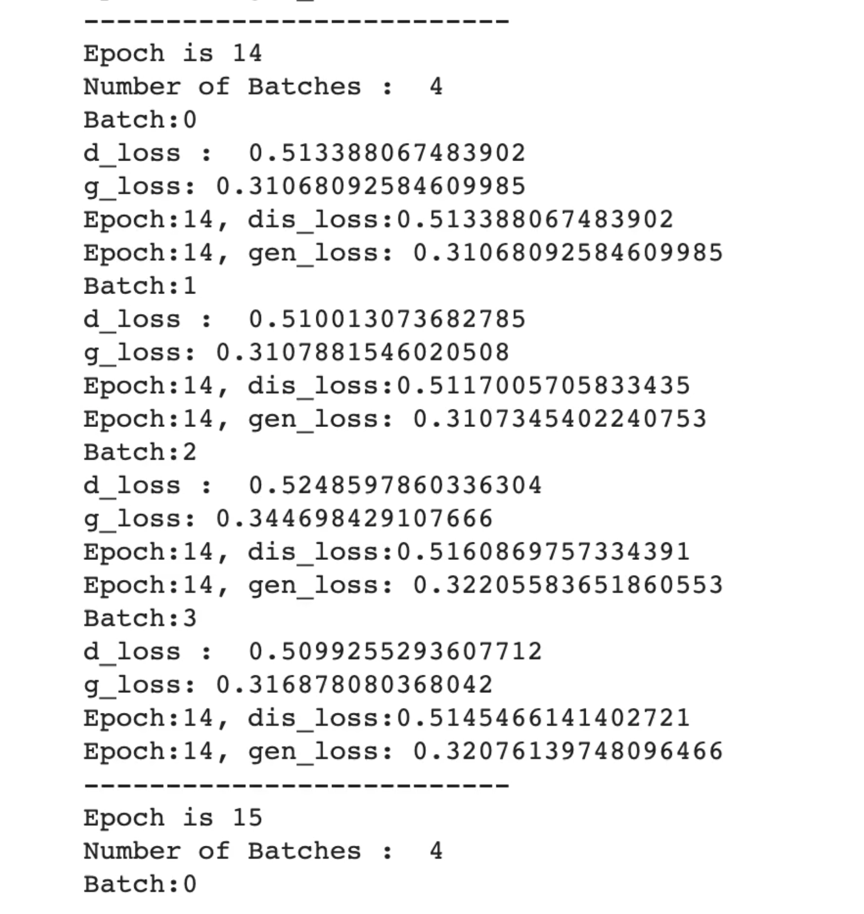
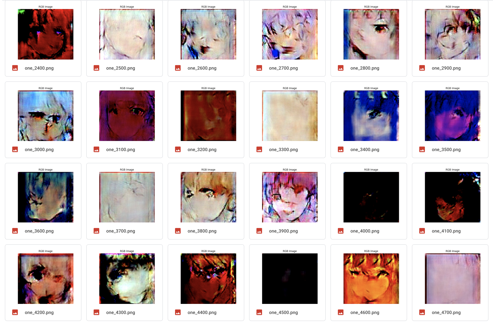

# Anime-DCGAN v1.0.1 
### This is a simple implementation of DCGAN (keras) to generate anime character's faces.
### The model was originally trained for 5000 eopchs, but it is recommended to trian the model for atleast 10,000 epochs for good outputs !
### The example images are pixeleted as the images fed to network for training were 64 by 64 and the output images are generated from a latent vector of size 100
## These are some sample images generated by the model in training process !
<!-- -->
<!-- -->
<!-- -->

This project is one of the projects from the Book -> "Generative Adversarial Networks Projects by Ahirwar & Kailash"
This readme file will help you replicate my steps and help you in succesfully training a DCGAN to generate animefaces.
Before following all the steps download all the required dependancies.
```
pip install -r requirements.txt
```

### Dataset 
To download the dataset we will use a web scraping tool gallery-dl, simply open up the terminal and type the following command.
NOTE : Run this command in the directory where you want images to load it will automatically create a folder named gallery-dl and will save
       the data. 
```
pip install gallery-dl 
gallery-dl "https://danbooru.donmai.us/posts?tags=face”
```
I downloaded around 600 images (which is less for generating highly accurate & clear images)

The dataset includes many unwanted parts other than faces, which can hinder perfomance of the network and is not suitable for this 
specific task so we will [anime-face-detector](https://github.com/qhgz2013/anime-face-detector.git) to detect animefaces and 
crop out the face portion out of each images, therefore we will get a useful clean dataset. To use the anime-face-detector please follow the 
instructions in the link mentioned above (anime-face-detector's repository).
Run the below command from anime-face-detector's cloned folder (follow complete steps from : [anime-face-detector](https://github.com/qhgz2013/anime-face-detector.git)
```
python main.py -i /path/to/image/or/folder -crop-location /path/to/store/cropped/images -start-output 1
```

After cropping out faces resize the images (64 * 64) using the image_resizer.py script(before running the script make an empty folder where you will store
cropped images)
```
python image_resizer.py 
```

We are done with all the required steps to setup the dataset and make use of it to train our DCGAN.

### Model Structure & Training Process Explanation : 
I will not cover all the basics of GANs (you can easily read theory online), but you can see the Discriminator & Generator Structures in the images below.

Discriminator Network :
<!-- -->

Generator Network :
<!-- -->

##### Training Process Explanation:
1. Initially both networks have random weights 
2. First we will train Discriminator Network on batch of random sample 
3. To do this we need fake samples as well as real samples. We already have real samples, so we need to generate fake samples.
4. To generate fake samples, create a latent vector of a shape of (100,) over a uniform distribution. Feed this latent vector to the untrained generator network.         The generator network will generate fake samples that we use to train our discriminator network.
5. Concatenate the real images and the fake images to create a new set of sample images. We also need to create an array of labels: label 1 for real images and   label 0 for fake images.
6. After this we will train the generator network, to train the generator we need to train the adversarial model and we will freeze the discriminator model to prevent retraining.
7. After every 100 epoch, a image output will be saved in the results folder (create it before running the scripts) by this you can check the performance of the model and you can decide wether the model is learning to generate faces or not.

##### I trained the model for 5000 epochs (batch size 128), to generate highly accurate images training for 10,000 epochs is recommended. 
####  Hyperparameters :
##### Learning rate (for both networks) : 0.0005 
##### Momentum rate (for both networks) : 0.9 
##### Nesterov : True 
##### You can tweak some of the hyperparameters or try with a large dataset (1000+ images) can help you achieve more accurate output images.

##### Training :
Before executing the train.py script please set the paths for the data set directory in the script.
```
python train.py 
```

I recommend working with a virtual environment with python 3.6 or above 
If you have a device with lower specs, run the project on google colab, and set the path accordingly (Drive Paths)

If all the steps are correct you will see the training process as show below :
<!-- -->

Here is a sample of the images generated during training : 
<!-- -->

#### Future Updates:
### v2.0.0 in making ~ major updates :
### Optimized model (trained on 2000+ images (currently 500 images), activation changed and some minor optimizations)
### UI in making to generate animefaces for data augmentaion

The model has been trained for 10000 epochs, the model files will be soon pushed to github after further optimization with a user interface to generate outputs without any training needed from their side.
Will upload trained model files and a script to use the trained model and train it further.
Will upload DCGAN application and further use cases.
Further if you want to still use the trained model the links for the same are given below : <br />
[Discriminator model file h5](https://drive.google.com/file/d/13IAa1PxYG7ih3ezM_0tdbkoRjtSlkx-X/view?usp=sharing)<br />
[Generator model file h5](https://drive.google.com/file/d/13FskSLFBLIOwyq6MUsbxuwPa6ZJbjba4/view?usp=sharing)<br />

The ipynb file for people running the code on google colab is linked below :
https://colab.research.google.com/drive/1yonjMkXrJ5hqFW0UjQjCx87N_U54V_D1?usp=sharing

I have also uploaded the ipynb file, if you are running on google colab thes use this ipynb file.
Before executing the ipynb file upload all the files from this repo to your google drive and set all the paths accordingly.
Also create the required folders (results & saved models folders) on the drive.

This approach is same as depicted in the book "GAN Projects Ahirwar & Kailash", although the code in the book and their repository have some issues due to dependancies upgrade and the code is scrambled into one file, this code (uploaded by me) is a refactored version with corrected errors and is a working implementation. I will soon upload exciting applications using this model.


